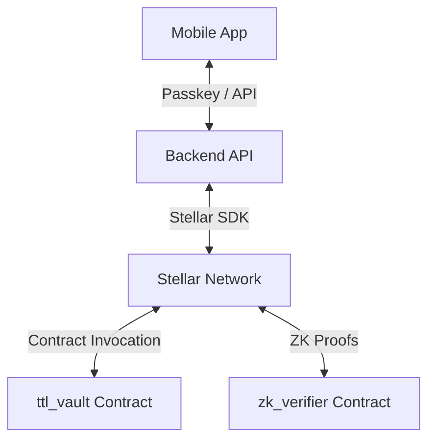
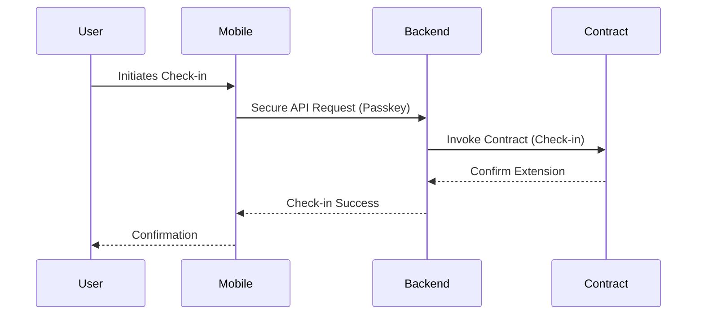
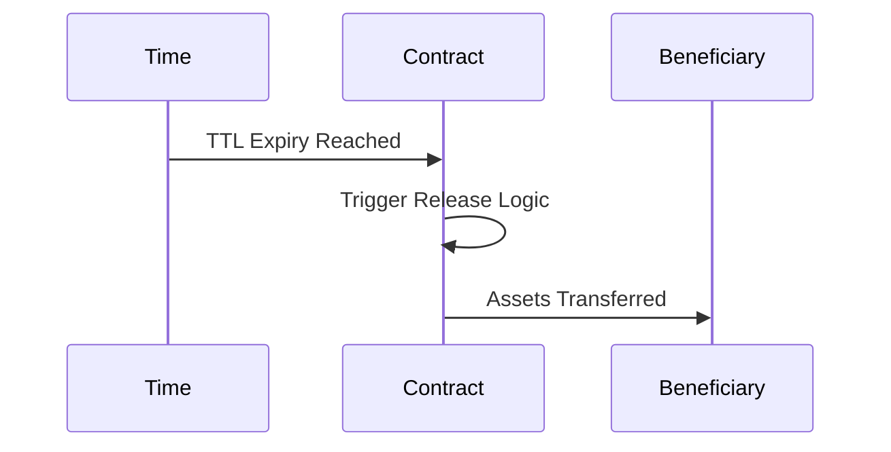

# Architecture Overview

The TTL-Legacy system is a decentralized, secure, and user-friendly platform built on the Stellar blockchain, designed to manage vault lifecycles based on Time-To-Live (TTL) logic.

## Component Diagram

The following diagram illustrates the interaction between the primary system components:

## Technology Stack

| Component | Technology | Rationale |
| :--- | :--- | :--- |
| **Smart Contracts** | Rust / Soroban | Secure, performant, and native to Stellar. |
| **Backend** | Rust / Axum | Type-safe, high-concurrency, efficient performance. |
| **Mobile (Android)** | Kotlin | Native performance, jetpack compose UI. |
| **Mobile (iOS)** | Swift | Native performance, SwiftUI. |
| **Blockchain** | Stellar | Low cost, fast finality, robust smart contract platform. |

## Data Flows

### Check-in Flow

This flow allows the vault owner to prove they are active and extend the TTL.

### Release Flow

When a vault reaches the end of its TTL without a successful check-in, the funds/assets are released to the designated beneficiary.

## Beneficiary Privacy Model

TTL-Legacy operates on a public blockchain, so all contract state is inherently readable by anyone with access to the network. The repository therefore documents the privacy model explicitly instead of pretending the beneficiary is private by default.

### Default behavior

- `Vault.beneficiary` remains stored as a plaintext `Address` for compatibility with existing querying, indexing, and legacy client code.
- The beneficiary is discoverable from on-chain storage before release and can be used by attackers for social engineering.
- This is an intentional tradeoff: it preserves interoperable access patterns and minimizes breaking changes, while acknowledging the transparency of Soroban state.

### Optional privacy layer

- For privacy-sensitive vaults, the owner may commit to the beneficiary using a hash commitment, e.g. `sha256(raw_beneficiary_address_bytes)`.
- The commitment is stored as `BeneficiaryCommitment(u64)` and remains hidden until a later reveal event.
- At release time, anyone can call `reveal_beneficiary` with the raw beneficiary bytes and a proof; the contract verifies the hash and then transfers funds to the revealed address.
- This reduces pre-release targeting exposure, but it is not cryptographic anonymity: the beneficiary becomes public at release, and any public release event or transfer still exposes the final address.

### Design decision

This project treats privacy as a best-effort layer layered on top of public blockchain state, not as a guarantee that all beneficiary identities stay hidden forever. The commitment path is offered as an opt-in mechanism for users who value privacy more than maximum compatibility.

## Component Documentation

For detailed information on specific components, please refer to the following:

- **Smart Contracts**: `contracts/ttl_vault/src/lib.rs`, `contracts/zk_verifier/src/lib.rs`
- **Backend API**: `docs/backend-api.md`, `docs/openapi.yaml`
- **TTL Logic**: `docs/ttl-logic.md`
- **Mobile Passkeys**: `docs/mobile-passkey-flow.md`, `docs/passkeys.md`
- **ZK Verifier**: `docs/zk-verifier.md`
- **Token Management**: `docs/token-management.md`

## Storage Keys

All contract storage entries are defined in the `StorageKey` enum (`contracts/ttl_vault/src/types.rs`). The enum ensures unique serialization for every key and makes storage usage auditable.

### Instance Keys

| Variant | Type | Description |
| :--- | :--- | :--- |
| `TokenAddress` | `Address` | XLM token contract address |
| `Admin` | `Address` | Contract administrator |
| `Paused` | `bool` | Global contract pause flag |
| `PauseRecord` | `PauseRecord` | Pause/unpause audit record |
| `PendingAdmin` | `Address` | Pending admin transfer |
| `MinCheckInInterval` | `u64` | Minimum check-in interval (seconds) |
| `MaxCheckInInterval` | `u64` | Maximum check-in interval (seconds) |
| `MaxTtlSeconds` | `u64` | Maximum TTL cap (seconds) |
| `TtlDecayRate` | `u64` | TTL decay rate (seconds) |
| `ReleaseGracePeriodSeconds` | `u64` | Grace period after expiry |
| `Version` | `String` | Contract version |
| `MinCheckInCooldown` | `u64` | Minimum check-in cooldown |
| `PendingProtocolConfig` | `ProtocolConfig` | Pending protocol configuration |
| `ProtocolConfigProposedAt` | `u64` | Protocol config proposal timestamp |
| `AdminTransferProposedAt` | `u64` | Admin transfer proposal timestamp |
| `RequireUtf8Metadata` | `bool` | UTF-8 metadata enforcement flag |

### Persistent Keys (per-vault / per-entity)

| Variant | Type | Description |
| :--- | :--- | :--- |
| `Vault(u64)` | `Vault` | Primary vault state |
| `OwnerVaults(Address)` | `Vec<u64>` | Vault IDs owned by an address |
| `MaxVaultsPerOwner` | `u64` | Max vaults per owner limit |
| `BeneficiaryVaults(Address)` | `Vec<u64>` | Vault IDs where address is beneficiary |
| `VaultCount` | `u64` | Total vault count |
| `VestingSchedule(u64, u32)` | `VestingSchedule` | Vesting schedule by vault + index |
| `VestingPenalty(u64, u32)` | `VestingPenaltyConfig` | Vesting penalty config |
| `VestingPendingClaim(u64, u32)` | `VestingPendingClaim` | Pending vesting claim |
| `VestingScheduleCount(u64)` | `u64` | Number of vesting schedules |
| `MilestoneVestingSchedule(u64)` | `MilestoneVestingSchedule` | Milestone-based vesting |
| `CountdownFired(u64)` | `bool` | Countdown notification fired flag |
| `TokenWhitelist(Address)` | `bool` | Token allowlist entry |
| `WrappedToken(Address)` | `bool` | Wrapped token registration flag |
| `VaultMetadata(u64)` | `String` | Vault display metadata |
| `ParentVault(u64)` | `u64` | Parent vault for cloned vaults |
| `VaultPasskeys(u64)` | `Vec<PasskeyHash>` | Vault passkey list |
| `BackupCodes(u64)` | `EncryptedBackupCodes` | Encrypted backup codes |
| `BeneficiaryDelegate(u64)` | `Address` | Check-in delegate |
| `BeneficiaryDelegationChain(u64)` | `Vec<Address>` | Delegation chain |
| `WithdrawalSchedule(u64)` | `Vec<WithdrawalScheduleEntry>` | Scheduled withdrawals |
| `DisputeStatus(u64)` | `DisputeStatus` | Dispute state |
| `ConditionalAcceptance(u64)` | `ConditionalAcceptanceEntry` | Conditional acceptance config |
| `ArchivedVault(u64)` | `ArchivedVaultInfo` | Archived vault snapshot |
| `BridgeConfig(u32)` | `BridgeConfig` | Cross-chain bridge config |
| `TokenConversion(u64)` | `TokenConversion` | Token conversion config |
| `TokenStaking(u64)` | `TokenStaking` | Token staking config |
| `PasskeyUsage(u64)` | `PasskeyUsageStat` | Passkey usage statistics |
| `BeneficiaryStatus(u64)` | `BeneficiaryStatus` | Beneficiary acceptance status |
| `PasskeyExpiry(u64, BytesN<32>)` | `u64` | Passkey expiry timestamp |
| `PendingOwnership(u64)` | `OwnershipTransferRequest` | Pending ownership transfer |
| `PendingBeneficiaryUpdate(u64)` | `PendingBeneficiaryUpdate` | Pending beneficiary update |
| `VaultAuditLog(u64)` | `Vec<AuditEntry>` | Vault audit trail |
| `MultiSigConfig(u64)` | `MultiSigConfig` | Multi-sig configuration |
| `MultiSigProposal(u64, u64)` | `MultiSigProposal` | Multi-sig proposal |
| `MultiSigProposalCount(u64)` | `u64` | Multi-sig proposal counter |
| `MetadataHistory(u64)` | `Vec<MetadataVersionEntry>` | Metadata version history |
| `CustomMetadataHistory(u64)` | `Vec<Bytes>` | Custom metadata history |
| `OwnerVaultCount(Address)` | `u64` | Number of vaults owned |
| `StateTransitionLog(u64)` | `Vec<StateTransitionEntry>` | State transition audit log |
| `PasskeyChallenge(u64, BytesN<32>)` | `PasskeyChallenge` | Passkey authentication challenge |
| `WithdrawalApprovals(u64)` | `Vec<Address>` | Withdrawal approvers |
| `VaultSnapshot(u64, u64)` | `Vault` | Vault state snapshot |
| `VaultSnapshotTimestamps(u64)` | `Vec<u64>` | Snapshot timestamps |
| `CheckInHistory(u64)` | `Vec<CheckInHistoryEntry>` | TTL prediction history |
| `CheckInEntry(u64, u32)` | `CheckInHistoryEntry` | Paginated check-in entry |
| `CheckInHistoryHead(u64)` | `u32` | Ring buffer head pointer |
| `CheckInHistoryLen(u64)` | `u32` | Number of history entries |
| `CheckInStreak(u64)` | `CheckInStreak` | Check-in streak tracking |
| `CheckInNonce(u64)` | `u64` | Proof-of-work nonce |
| `CheckInDelegates(u64)` | `Vec<Address>` | Check-in delegates |
| `DelegateNonce(u64, Address)` | `u64` | Per-delegation nonce |
| `CheckInDelegateExpiry(u64, Address)` | `u64` | Delegate expiry timestamp |
| `ProofOfLife(u64)` | `ProofOfLifeEntry` | Proof-of-life record |
| `ReleaseVotes(u64)` | `Vec<ReleaseVoteEntry>` | Release votes |
| `ReleaseVoteThreshold(u64)` | `u32` | Release vote threshold |
| `BeneficiaryIdentityOracle(u64)` | `Address` | Identity oracle address |
| `BeneficiaryIdentityVerification(u64)` | `BeneficiaryIdentityVerification` | Identity verification record |
| `BeneficiaryReleaseTriggers(u64)` | `Vec<(Address, Vec<ReleaseTrigger>)>` | Per-beneficiary release triggers |
| `BeneficiaryTierThreshold(u64, Address)` | `u32` | Tier threshold |
| `BeneficiaryStatusEntry(u64, Address)` | `BeneficiaryStatus` | Per-beneficiary status |
| `BeneficiaryReleaseConditionVeto(u64)` | `bool` | Veto flag |
| `ReleaseAttempted(u64)` | `bool` | Release attempt flag |
| `Hibernation(u64)` | `HibernationEntry` | Hibernation state |
| `LastCheckInTime(u64)` | `u64` | Last check-in ledger timestamp |
| `VaultDuplicate(Address, Address, u64)` | `u64` | Duplicate vault prevention |
| `BeneficiaryRotationSchedule(u64)` | `Vec<BeneficiaryRotationEntry>` | Rotation schedule |
| `CheckInGeoLog(u64)` | `Vec<GeoCheckInEntry>` | Geographic check-in log |
| `TtlBorrow(u64)` | `TtlBorrowRecord` | TTL borrow record |
| `EncryptedBackupCodes(u64)` | `EncryptedBackupCodes` | Encrypted backup codes |
| `WithdrawalAuditLog(u64)` | `Vec<AuditEntry>` | Withdrawal audit trail |
| `WithdrawalDisputes(u64)` | `DisputeStatus` | Withdrawal dispute state |
| `WithdrawalScheduleValidation(u64)` | `Vec<WithdrawalScheduleEntry>` | Schedule validation records |
| `WithdrawalLimit(u64)` | `WithdrawalLimit` | Withdrawal limits |
| `WithdrawalTracker(u64)` | `WithdrawalTracker` | Withdrawal tracking |
| `WithdrawalWhitelist(u64)` | `Vec<WhitelistEntry>` | Withdrawal whitelist |
| `WithdrawalReversal(u64, u64)` | `WithdrawalReversal` | Withdrawal reversal record |
| `WithdrawalReversalCounter(u64)` | `u64` | Withdrawal reversal counter |
| `VestingCatchUp(u64)` | `VestingCatchUpConfig` | Catch-up vesting config |
| `VestingBonus(u64)` | `VestingBonusConfig` | Vesting bonus config |
| `YieldDistributionConfig(u64)` | `YieldDistributionConfig` | Yield distribution config |
| `TokenLending(u64)` | `TokenLending` | Token lending config |
| `TokenCollateral(u64)` | `TokenCollateral` | Token collateral config |
| `TokenHedge(u64)` | `TokenHedge` | Token hedging config |
| `TokenRebalance(u64)` | `TokenRebalanceConfig` | Token rebalance config |
| `BeneficiaryPool(u64)` | `BeneficiaryPool` | Beneficiary pool config |
| `BeneficiaryPoolAlloc(u64)` | `Vec<u128>` | Pool allocation amounts |
| `BeneficiaryVestingSchedule(u64, Address)` | `VestingSchedule` | Per-beneficiary vesting |
| `BeneficiaryVestingCount(u64)` | `u32` | Per-beneficiary schedule count |
| `BeneficiaryAuction(u64)` | `BeneficiaryAuction` | Beneficiary auction |
| `BeneficiaryAuctionBid(u64, Address)` | `i128` | Auction bid amount |
| `BeneficiaryAuctionCount` | `u64` | Auction counter |
| `PendingMultiSigOp(u64, u64)` | `MultiSigOperation` | Pending multi-sig operation |
| `PendingMultiSigOpNonce(u64)` | `u64` | Multi-sig nonce counter |
| `PendingUpgrade` | `UpgradeProposal` | Pending upgrade proposal |
| `AllowedTokens` | `Vec<Address>` | Token allowlist |
| `OpenProposals(u64)` | `u64` | Open proposal count |
| `TwoFactorConfig(u64)` | `bool` | 2FA config flag |
| `TwoFactorVerified(u64)` | `bool` | 2FA verified flag |
| `VaultFrozen(u64)` | `bool` | Admin freeze flag |
| `ReleaseConditions(u64)` | `Vec<ReleaseCondition>` | Release conditions |
| `ReleaseGracePeriodSeconds` | `u64` | Release grace period |
| `VestingMilestones(u64)` | `Vec<VestingMilestone>` | Vesting milestones |
| `VestingMilestoneCount(u64)` | `u64` | Milestone count |
| `VestingRollover(u64)` | `bool` | Vesting rollover flag |
| `VestingForfeiture(u64)` | `bool` | Vesting forfeiture flag |
| `VestingAcceleration(u64)` | `bool` | Acceleration on death flag |
| `VestingStagger(u64)` | `bool` | Staggered vesting flag |
| `WithdrawalProof(u64, u64)` | `WithdrawalProof` | Withdrawal proof |
| `WithdrawalEscrow(u64)` | `WithdrawalEscrow` | Escrowed withdrawal |
| `WithdrawalRollback(u64)` | `WithdrawalRollback` | Rollback record |
| `WithdrawalRateLimit(u64)` | `WithdrawalRateLimit` | Rate limit config |
| `RevealedBeneficiary(u64)` | `Address` | Revealed beneficiary |
| `BeneficiaryCommitment(u64)` | `BytesN<32>` | Beneficiary commitment |
| `RecoveryContacts(u64)` | `Vec<Address>` | Recovery contacts |
| `PasskeyRecoveryRequest(u64)` | `PasskeyRecoveryRequest` | Recovery request |
| `PasskeyRotationPolicy(u64)` | `PasskeyRotationPolicy` | Rotation policy |
| `CustomMetadataHistory(u64)` | `Vec<Bytes>` | Custom metadata history |
| `ReleaseVoteThreshold(u64)` | `u32` | Release vote threshold |
| `VestingScheduleCount(u64)` | `u64` | Number of schedules |
